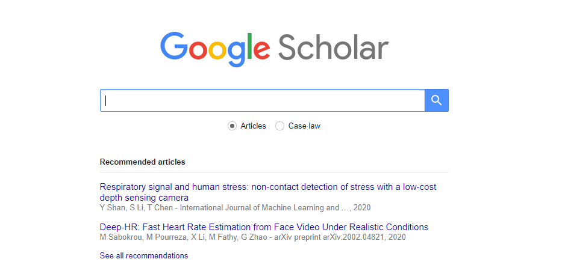
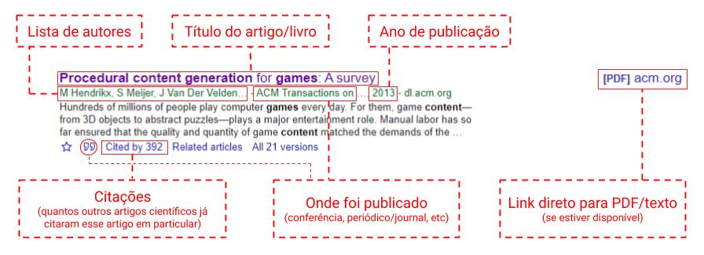
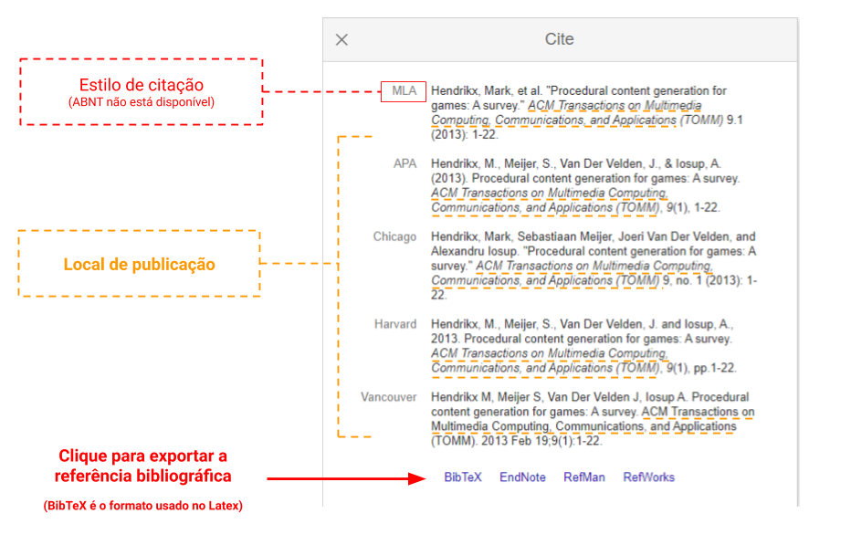
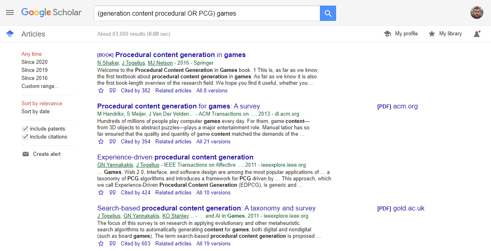
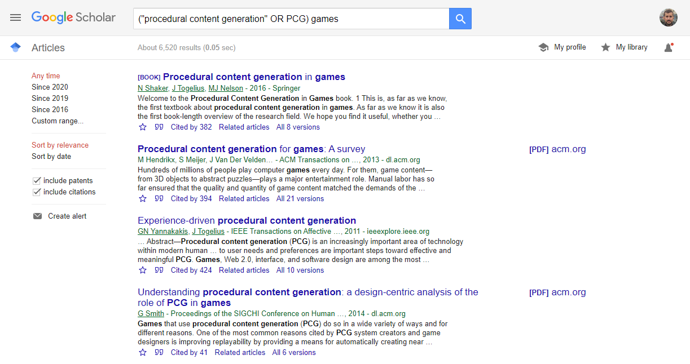
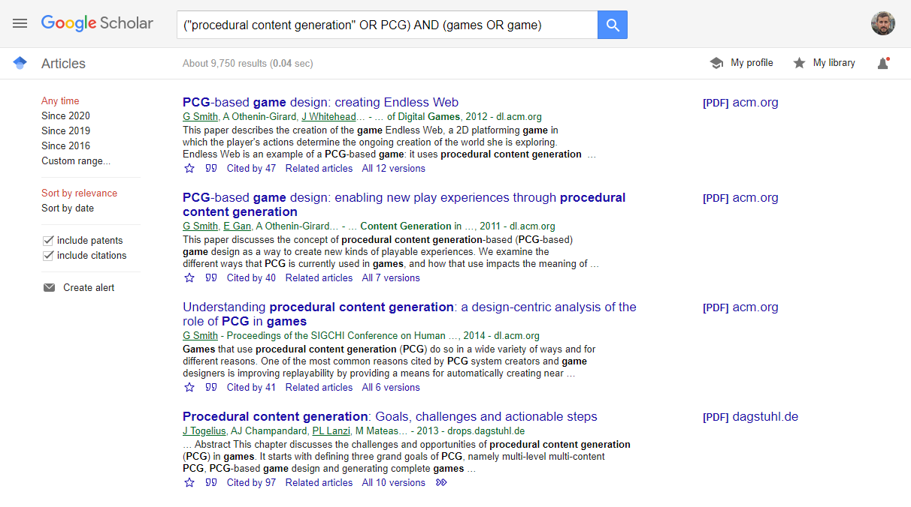

# Revisão bibliográfica

A revisão bibliográfica, ou revisão do estado da arte, é o processo de conhecer e analisar os trabalhos científicos que trabalham com um mesmo assunto/problema que a sua pesquisa. Em linha gerais, é uma forma de saber o que (e como) os outros estão fazendo para resolver um problema.

Fazer uma revisão bibliográfica significa ler vários artigos científicos para poder escrever sobre eles no seu TCC. Geralmente isso é feito em uma seção de _trabalhos relacionados_ (ou seja, trabalhos científicos parecidos ou *iguais* ao seu) ou na seção de [fundamentação teórica](fundamentacao-teorica.md).

Para encontrar artigos, você precisa utilizar alguma base científica de busca, tais como as seguintes:

* [Google Scholar](https://scholar.google.com)
* [Microsoft Academic](https://academic.microsoft.com)
* [Periódicos CAPES/MEC](https://www.periodicos.capes.gov.br)

Esse tutorial utilizará o [Google Scholar](https://scholar.google.com) como base científica de busca.

## 1. Acesse o Google Scholar

Ao acessar o [Google Scholar](https://scholar.google.com), há um campo de busca como no Google:

Informe o que você deseja buscar e clique no botão de busca. Diferentemente do Google, o resultado dessa busca serão apenas artigos científicos (e livros), mas não websites em geral.

No exemplo abaixo, o termo **procedural content generation** foi buscado:

Os artigos retornados pela busca estão de alguma forma relacionados com o que você buscou, seja porque contém o termo buscado no título ou em eu resumo/abstract.

### 1.1 Interpretando o resultado da busca

Cada item retornado possui diversas informações, como o título, autores e parte do resumo:

Você pode observar o seguinte em um resultado de busca:

Geralmente você está em busca de um artigo que tenha:

* Alto número de citações (mais que zero, por exemplo): isso significa que esse é um trabalho relevante e que outros pesquisadores estão usando ele para fundamentar suas pesquisas. Muitas citações (acima de 200, por exemplo) indica um trabalho importante e consolidado.

* Ano de publicação recente: quanto mais atual um trabalho, maior é a chance dele cobrir aspectos/problemas/tecnologias/teorias recentementes. Ser recente não é um indicativo necessário de qualidade. Um artigo _antigo_, por exemplo, com muitas citações, é indicativo de uma peça fundamental de teoria em alguma área, ex.: uma técnica/teoria que muitos usam.

* Onde foi publicado: meio no qual esse artigo foi publicado, que pode ser, por exemplo, uma conferência ou periódico (também chamado de revista ou journal).

> **DICA:** para saber se uma conferência/periódico/journal é confiável, busque pelo nome dele no site [qualis.ic.ufmt.br](https://qualis.ic.ufmt.br) e confira o **Extrato CAPES** (também conhecido como **Qualis**). Os valores possíveis do Qualis são (na ordem do mais para o menos importante): A1, A2, B1, B2, B3, B4 e B5. Quando mais próximo do A1, mais consolidado (e confiável) é o veículo de publicação. Veículos com qualis B5 ou sem qualis geralmente não são muito estabelecidos ainda (pouco impacto científico). 

### 1.2 Ferramentas úteis na busca

Além dessa informações, o resultado contém alguns botões/links muito útis que podem ajudar no seu trabalho:

O botão da "estrela" permite que você salve essa referência na sua biblioteca do Google Scholar. Essa é uma forma rápida de guardar artigos para consultar depois. Você pode acessar sua biblioteca do Google Scholar clicando em [My library](https://scholar.google.se/scholar?scilib=1&hl=en&as_sdt=0,5) no canto superior direito da página.

> **DICA:** Artigos salvos na biblioteca do Google Scholar ficam na sua conta do Google, então você pode fechar a página e voltar outro dia sem perder seus artigos.

O botão das "aspas" mostra as informações bibliográficas (de citação) do artigo:

Você pode consultar, por exemplo, o nome completo do veículo onde o artigo foi publicado. Além disso, você pode clicar nos links para exportar a refência bibliográfica. O formato BibTeX, por exemplo, é o formato utilizado pelo Latex.

> **DICA:** veja a página [Aprenda Latex em 5 minutos](latex-5min.md) para saber como importar e utilizar uma referência bibliográfica BibTeX.

## 2. Defina uma string de busca

Buscar em uma base científica é muito parecido como utilizar o Google, mas você precisa refinar sua busca. Caso contrário, é provável que você não consiga fazer um bom panorama do estado da arte.

> **DICA:** seu orientador(a) provavelmente já tem uma string de busca bem definida que você pode usar. Quando melhor a string de busca, mais chances você tem de encontrar material relevante para sua pesquisa.

A melhor forma de entender o que é uma string de busca é ver ela em ação. Imagine que você procura sobre geração procedural de conteúdo para games. Uma string de busca possível é _procedural content generation games_, que resulta no seguinte:

O termo _Procedural Content Generation_ geralmente é abreviado como PCG, então precisamos cobrir isso também. Nesse caso, podemos usar parêntes e o operador _OR_ na string para garantir que _procedural content generation_ *ou* PCG serão encontrados juntamente com games:

Apenas escrever _procedural content generation_, porém, não garante que a busca retorne itens que contenham essas 3 palavras, nessa mesma ordem. Por exemplo, podemos buscar por _generation content procedural_ ao invés de _procedural content generation_ e encontrar praticamente os mesmos resultados:

Para garantir que um termo de várias palavras seja encontrado, você pode colocar o termo entre áspas duplas. O termo de busca passa a ser, então, _"procedural content generation"_:

E se você quiser procurar por geração procedural de conteúdo (e suas variações) no contexto de games, que também tem variações nas palavras? Alguém pode ter escrito _game_ ao invés de _games_ em um artigo, por exemplo.

Nesse caso, usando a mesma lógica de antes, utilizam-se parêntes e o operador *OR* com os termos relacionados a games. Pode-se escrever, então, _games_ ou _game_:

Por fim, se você quer garantir que os termos "procedural content generation" ou PCG *e* games ou game sejam encontrados juntos, você pode combinar os operadores *AND* e *OR* e as expressões entre parênteses: 

## 3. Leia vários artigos

Depois que você definiu uma boa string de busca junto ao seu orientador(a), é hora de ler os artigos. Você não precisa ler todos os artigos existentes no planeta, mas precisa ler uma quantidade razoável. Quantos? Não há um número mágico, mas você precisa ter lido o suficiente para entender o problema e, principalmente, o que os outros estão fazendo para solucionar esse problema.

Quanto mais artigos você ler, mais chances você tem de identificar autores importantes, trabalhos correlatos ao seu ou entre si. Uma forma eficiente de ler artigos em uma revisão bibliográfica é ler o abstract, a introdução e os resultados do artigo. Lendo essas seções, você tem uma boa ideia se o artigo em questão está ou não relacionado ao seu TCC. Se for relacionado, leia o artigo por completo. Se estiver minimamente relacionado, você pode guardar para ler depois ou utilizar como uma referência complementar. Se o artigo não estiver relacionado, descarte o artigo.

> **DICA:** o importante para uma boa revisão bibliográfica é ter um visão mínima do campo. Pricipalemente **o que, como e os resultados** que outros tiveram. Faça um pequeno resumo de cada artigo relevante mencionamento exatamente isso: o que, como e os resultados obtidos pelos autores. Esse pequeno resumo pode ser colocado na íntegra no capítulo de _trabalhos relacionados_ do seu TCC.

Identificando o que, como e quais resultados foram obtidos por outros pesquisadores, você pode posicionar o seu trabalho. Em outras palavras, você pode dizer o que é igual, o que é diferente, e o que é esperado acontecer. Uma metáfora simples para esse contexto é imaginar que você está "amarrando" seu trabalho: quanto mais artigos você leu, mais você consegue dizer o quão similar (ou diferente) eles são entre si e em relação ao seu trabalho; dessa forma, mais "amarrado a outros" e fundamentado é o seu trabalho.

Essa é a base da ciência: construir sobre aquilo que já foi feito, testado e fundamentado. Você não precisa se estressar em fazer algo completamente diferente. Foque em entender o que e como algo foi feito, e ache um detalhe mínimo que você pode tentar fazer diferente. Mesmo que você replique exatamente o mesmo procedimento de um trabalho anterior, o fato de repetir ele pelas próprias mãos já é algo diferente. Você está comprovando algo.

## 4. Converse com seu orientador(a) frequentemente

Seu orientador(a) possui experiência de pesquisa e pode ajudar a entender ou analisar um artigo. Faça reuniões periódicas para saber se está no caminho certo. Não tenha medo de perguntar ou verificar.

# Mais informações

* [Como trabalhar meu projeto no Overleaf](docs/overleaf.md)
* [Aprenda Latex em 5 minutos](docs/latex-5min.md)